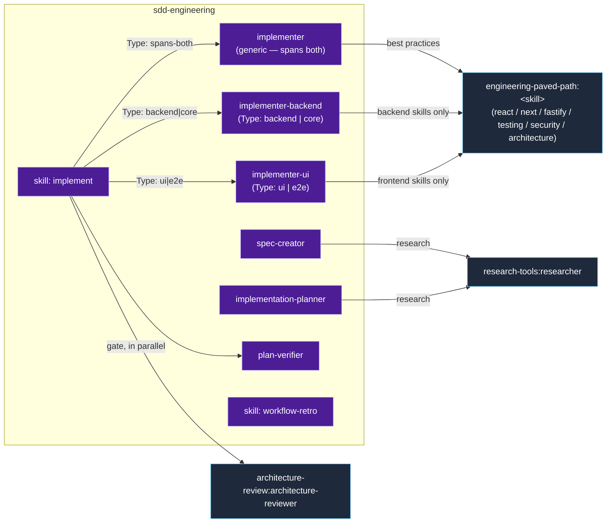

# Dependency graph — what we are building

A visual map of the four plugins. Full specification —
[`PLUGINS-SPEC.md`](./PLUGINS-SPEC.md).

## 1. Install-time: who depends on whom

`sdd-engineering` (the consumer) depends on three reusable plugins at
`^1.0.0`. In addition, `architecture-review` itself depends on
`engineering-paved-path` — its `architecture-reviewer` builds on the same
engineering best practices (architecture/security/testing skills), so
this is **a DAG, not a star**.

```mermaid
graph TD
  classDef consumer fill:#4c1d95,stroke:#c4b5fd,color:#fff,rx:8,ry:8;
  classDef dep fill:#1e293b,stroke:#7dd3fc,color:#fff,rx:8,ry:8;

  SDD["<b>sdd-engineering</b> · consumer<br/><i>agents:</i> spec-creator · implementation-planner · implementer (+backend/ui profiles) · plan-verifier<br/><i>skills:</i> implement · workflow-retro · engineering-insights<br/><i>+ evals, docs</i>"]:::consumer

  EPP["<b>engineering-paved-path</b> · dependency<br/><i>skills:</i> react · next · fastify · testing · security · architecture<br/>(+ typescript · zod · drizzle · postgres)"]:::dep
  RT["<b>research-tools</b> · dependency<br/><i>agent:</i> researcher (read-only)"]:::dep
  AR["<b>architecture-review</b> · dependency<br/><i>agent:</i> architecture-reviewer (generalized)"]:::dep

  SDD -->|"depends ^1.0.0"| EPP
  SDD -->|"depends ^1.0.0"| RT
  SDD -->|"depends ^1.0.0"| AR
  AR  -->|"depends ^1.0.0"| EPP
```



> `engineering-paved-path` is the shared foundation: both `sdd-engineering`
> and `architecture-review` depend on it. It depends on nothing.

## 2. Runtime: how `sdd-engineering` pulls in its dependencies (via namespace)

The consumer's components reference other plugins' skills/agents **only
namespaced** (never by bare name).



## 3. Build and release order

Dependencies come first (the consumer won't install cleanly without
them):

```
1. engineering-paved-path   (skills only — the foundation, no dependencies)
2. research-tools           (researcher — clean, ports almost as-is)
3. architecture-review      (generalized architecture-reviewer; depends on engineering-paved-path)
4. sdd-engineering           (6 agents + implement + workflow-retro + engineering-insights; depends on all three)
```

Each is registered as its own entry in `.claude-plugin/marketplace.json`.
The `dependencies` field in `plugin.json` is an **array** of
`{ "name", "version" }` entries (not an object map):

```jsonc
// plugins/sdd-engineering/.claude-plugin/plugin.json
"dependencies": [
  { "name": "engineering-paved-path", "version": "^1.0.0" },
  { "name": "research-tools",         "version": "^1.0.0" },
  { "name": "architecture-review",    "version": "^1.0.0" }
]

// plugins/architecture-review/.claude-plugin/plugin.json
"dependencies": [
  { "name": "engineering-paved-path", "version": "^1.0.0" }
]
```
